# Information Flow Flowchart
**Visual Architecture: Traits → Decisions → Implementation**

---

## How to Use This Flowchart

This flowchart maps the complete information flow from:
1. **Recommended Traits** (your metadata structure)
2. **Expert Domains** (20 categories)
3. **Decision Point** (Crypto vs. AI Agents)
4. **Implementation Path** (what to build)

You can view this flowchart by:
- Copying the Mermaid code into https://mermaid.live/
- Using VS Code with the "Markdown Preview Mermaid Support" extension
- Viewing on GitHub (which renders Mermaid automatically)

---

## Master Flowchart: Complete Information Flow

---

## Breakdown: Trait-Specific Flows

### Flow 1: Integration Layer → Implementation

### Flow 2: Tokenization Ready → Decision

### Flow 3: UX Binding Type → Interface

### Flow 4: Expert Domain → Mentor → Actions

---

## Decision Tree: Crypto vs. AI Agents

---

## Credential Mapping Flow

```mermaid
graph TB
    User[You: NerveMap] --> Cred{Current Credentials}
    
    Cred --> C1[✅ GitHub Basic]
    Cred --> C2[⚠️ Music Production]
    Cred --> C3[⚠️ NFT Minting Basic]
    Cred --> C4[❌ Smart Contracts]
    Cred --> C5[❌ AI Engineering]
    Cred --> C6[❌ Backend Development]
    
    C1 --> Need1[Need: DevOps Engineer]
    C2 --> Need2[Need: Audio Engineer Mentor]
    C3 --> Need3[Need: Smart Contract Developer]
    C4 --> Need3
    C5 --> Need4[Need: ML Engineer]
    C6 --> Need5[Need: Backend Developer]
    
    Need1 --> Action1[Learn: GitHub Actions, CI/CD]
    Need2 --> Action2[Practice: Stems, Mixing, Mastering]
    Need3 --> Action3[Learn: Solidity, Remix IDE, Ethers.js]
    Need4 --> Action4[Learn: LangChain, AutoGen, OpenAI API]
    Need5 --> Action5[Learn: Python FastAPI, Node.js Express]
    
    Action1 --> Priority{Priority Based on Choice}
    Action2 --> Priority
    Action3 --> Priority
    Action4 --> Priority
    Action5 --> Priority
    
    Priority -->|If Crypto| HighPriorityCrypto[High: Action3, Action5, Action1]
    Priority -->|If AI Agent| HighPriorityAgent[High: Action4, Action5, Action1]
    
    classDef credStyle fill:#e3f2fd,stroke:#0d47a1,stroke-width:2px
    classDef needStyle fill:#fff3e0,stroke:#e65100,stroke-width:2px
    classDef actionStyle fill:#e8f5e9,stroke:#1b5e20,stroke-width:2px
    
    class C1,C2,C3,C4,C5,C6 credStyle
    class Need1,Need2,Need3,Need4,Need5 needStyle
    class Action1,Action2,Action3,Action4,Action5 actionStyle
```

---

## Recommended Path Flow (Based on Analysis)

---

## How to Read These Flowcharts

1. **Start at the top** (usually "Start" or "User")
2. **Follow the arrows** to see the flow of information
3. **Decision points** are shown as diamonds `{}`
4. **Colors indicate categories**:
   - 🟦 Blue = Domains/Inputs
   - 🟧 Orange = Traits/Metadata
   - 🟪 Purple = Crypto Implementation
   - 🟩 Green = AI Agent Implementation
   - 🟨 Yellow = Decisions/Critical Points

5. **Use these flowcharts to**:
   - Explain your system to technical partners
   - Identify gaps in your understanding
   - Plan implementation order
   - Make the crypto vs. AI agent decision

---

## Exporting These Flowcharts

### For Presentations
1. Go to https://mermaid.live/
2. Paste any of the Mermaid code blocks above
3. Click "Actions" → "PNG" or "SVG"
4. Insert into slides

### For Documentation
1. Keep in Markdown (GitHub renders Mermaid automatically)
2. Use in README files
3. Link in project documentation

### For Collaboration
1. Share this file with technical partners
2. Ask them to mark which flows are unclear
3. Iterate based on their feedback

---

**Document Version**: 1.0  
**Last Updated**: 2026-02-17 15:16:32  
**Maintainer**: NerveMap  
**Tool**: Mermaid (https://mermaid.js.org/)